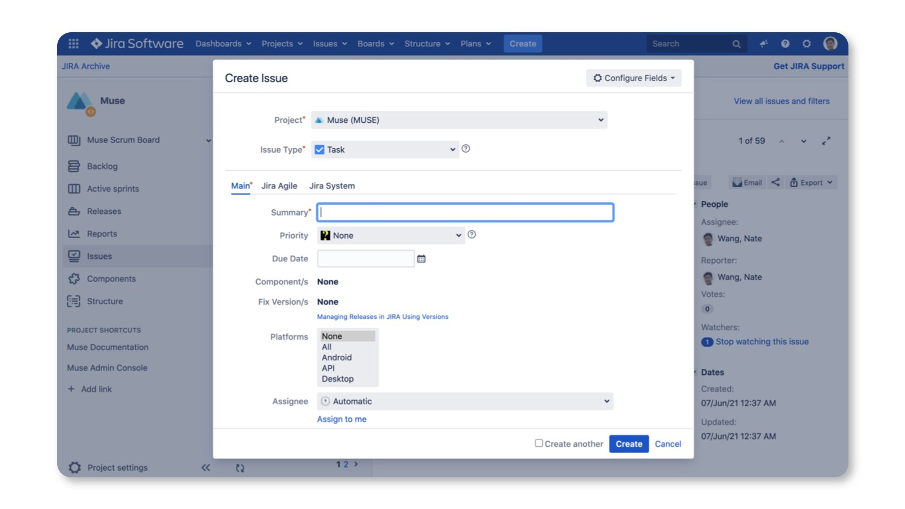

# Nice Modal

This is a small, zero dependency utility to manage modals in a natural way for React. It uses context to persist state of modals globally so that you can show/hide a modal easily either by the modal component or id.

> You can also see the introduction at [eBay tech blog](https://medium.com/ebaytech/rethink-modals-management-in-react-cf3b6804223d).

[](https://www.npmjs.com/package/@ebay/nice-modal-react)
[](https://www.npmjs.com/package/@ebay/nice-modal-react)
[](https://app.travis-ci.com/github/eBay/nice-modal-react)
[](https://codecov.io/github/eBay/nice-modal-react)
[](https://ebay.github.io/nice-modal-react/)
[](https://github.com/eBay/nice-modal-react/blob/main/LICENSE.md)

For example, you can use below code to show a modal anywhere:

```jsx
import NiceModal from '@ebay/nice-modal-react';
import MyModal from './MyModal';

//...
NiceModal.show(MyModal, { someProp: 'hello' }).then(() => {
  // do something if the task in the modal finished.
});
//...
```

Or you can register the modal with an id so that you don't need to import the modal component to use it:
```jsx
import NiceModal from '@ebay/nice-modal-react';
import MyModal from './MyModal';

NiceModal.register('my-modal', MyModal);

// you can use the string id to show/hide the modal anywhere
NiceModal.show('my-modal', { someProp: 'hello' }).then(() => {
  // do something if the task in the modal finished.
});
//...

```

**NOTE**: `@ebay/nice-modal-react` is not a React modal component but should be used with other modal/dialog implementions by UI libraries like [Material UI](https://material-ui.com/), [Ant.Design](https://ant.design), [Bootstrap React](https://react-bootstrap.github.io/), etc.

# Examples
You can see a list of examples at: https://ebay.github.io/nice-modal-react

# Key Features
* Zero dependency and small: ~2kb after gzip.
* Uncontrolled. You can close modal itself in the modal component.
* Decoupled. You don't have to import a modal component to use it. Modals can be managed by id.
* The code of your modal component is not executed if it's invisible.
* It doesn't break the transitions of showing/hiding a modal.
* Promise based. Besides using props to interact with the modal from the parent component, you can do it easier by promise.
* Easy to integrate with any UI library.

# Motivation
Using modals in React is a bit frustrating. Think of that if you need to implement below UI:



The dialog is used to create a JIRA ticket. It could be shown from many places, from the header, to the context menu, to the list page. Traditionally, we had declared modal components with a JSX tag. But then the question became, “Where should we declare the tag?”

The most common option was to declare it wherever it was being used. But using modals in a declarative way is not only about a JSX tag, but also about maintaining the modal’s state like visibility, parameters in the container component. Declaring it everywehre means managing state everywhere. It's frustrating.

The other option put it in the Root component, for example:

```jsx
const Root = () => {
  const [visible, setVisible] = useState(false);
  // other logic ...
  return (
    <>
      <Main />
      <NewTicketModal visible={visible} />
    </>
  );
}
```

However, when you declare the modal in the root component, there are some issues:

1. Not scalable. It's unreasonable to maintain the modal's state in the root component. When you need more modals you need to maintain much state, especially you need to maintain arguments for the modal.
2. It's hard to show or hide the modal from children components. When you maintain the state in a component then you need to pass `setVisible` down to the place where you need to show or hide the modal. It makes things too complicated.

Unfortunately, most examples of using modals just follow this practice, it causes such confusions when managing modals in React.

I believe you must once encountered with the scenario that originally you only needed to show a modal when click a button, then when requirements changed, you need to open the same modal from a different place. Then you have to refactor your code to re-consider where to declare the modal. The root cause of such annoying things is just because we have not understood the essential of a modal.

# Rethink the Modal Usage Pattern in React
According to the [wikipedia](https://en.wikipedia.org/wiki/Modal_window), a modal can be described as: 

> A window that prevents the user from interacting with your application until he closes the window.

From the definition we can get a conclusion: a modal is a global view that's not necessarily related with a specific context.

This is very similar with the page concept in a single page UI application. The visibility/ state of modals should be managed globally because, from the UI perspective, a modal could be showed above any page/component. The only difference between modal and page is: a modal allows you to not leave the current page to do some separate tasks.

For pages management, we already have router framework like React Router, it helps to navigate to a page by URL. Actually, you can think URL a global id for a page. So, similarly, what if you assign a uniq id to a modal then show/hide it by the id? This is just how we designed NiceModal.

However, besides using id, NiceModal allows to use the modal component directly to manage it.

# Usage
## Installation

```bash
# with yarn
yarn add @ebay/nice-modal-react

# or with npm
npm install @ebay/nice-modal-react
```

## Create Your Modal Component
With NiceModal you can create a separate modal component easily. It's just the same as you create a normal component but wrap it with high order compponent by `NiceModal.create`. For example, below code shows how to create a dialog with [Ant.Design](https://ant.design):

```jsx
import { Modal } from 'antd';
import NiceModal, { useModal } from '@ebay/nice-modal-react';

export default NiceModal.create(({ name }) => {
  // Use a hook to manage the modal state
  const modal = useModal();
  return (
    <Modal
      title="Hello Antd"
      onOk={() => modal.hide()}
      visible={modal.visible}
      onCancel={() => modal.hide()}
      afterClose={() => modal.remove()}
    >
      Hello {name}!
    </Modal>
  );
});
```

From the code, we can see:
* The modal is uncontrolled. You can hide your modal inside the component regardless where it is showed.
* The high order component created by `NiceModal.create` ensures your component is not executed before it becomes visible.
* You can call `modal.remove` to remove your modal component from the React component tree to reserve transitions.

Next, let's see how to use the modal.

## Using Your Modal Component
There are very flexible APIs for you to manage modals. See below for the introduction.

### Embed your application with `NiceModal.Provider`:
Since we will manage status of modals globally, the first thing is embedding your app with NiceModal provider, for example:

```js
import NiceModal from '@ebay/nice-modal-react';
ReactDOM.render(
  <React.StrictMode>
    <NiceModal.Provider>
      <App />
    </NiceModal.Provider>
  </React.StrictMode>,
  document.getElementById('root'),
);
```

The provider will use React context to maintain all modals' state.

### Using the modal by component
You can control a nice modal by the component itself.
```js
import NiceModal from '@ebay/nice-modal-react';
import MyAntdModal from './my-antd-modal'; // created by above code

function App() {
  const showAntdModal = () => {
    // Show a modal with arguments passed to the component as props
    NiceModal.show(MyAntdModal, { name: 'Nate' })
  };
  return (
    <div className="app">
      <h1>Nice Modal Examples</h1>
      <div className="demo-buttons">
        <button onClick={showAntdModal}>Antd Modal</button>
      </div>
    </div>
  );
}
```

### Use the modal by id
You can also control a nice modal by id:
```js
import NiceModal from '@ebay/nice-modal-react';
import MyAntdModal from './my-antd-modal'; // created by above code

// If use by id, need to register the modal component.
// Normally you create a modals.js file in your project
// and register all modals there.
NiceModal.register('my-antd-modal', MyAntdModal);

function App() {
  const showAntdModal = () => {
    // Show a modal with arguments passed to the component as props
    NiceModal.show('my-antd-modal', { name: 'Nate' })
  };
  return (
    <div className="app">
      <h1>Nice Modal Examples</h1>
      <div className="demo-buttons">
        <button onClick={showAntdModal}>Antd Modal</button>
      </div>
    </div>
  );
}
```


### Use modal with the hook
The `useModal` hook can not only be used inside a modal component but also any component by passing it a modal id/component:

```jsx
import NiceModal, { useModal } from '@ebay/nice-modal-react';
import MyAntdModal from './my-antd-modal'; // created by above code

NiceModal.register('my-antd-modal', MyAntdModal);
//...
// if use with id, need to register it first
const modal = useModal('my-antd-modal');
// or if with component, no need to register
const modal = useModal(MyAntdModal);

//...
modal.show({ name: 'Nate' }); // show the modal
modal.hide(); // hide the modal
//...
```

### Declare your modal instead of `register`
The nice modal component you created can be also used as a normal component by JSX, then you don't need to register it. For example:

```jsx
import NiceModal, { useModal } from '@ebay/nice-modal-react';
import MyAntdModal from './my-antd-modal'; // created by above code

function App() {
  const showAntdModal = () => {
    // Show a modal with arguments passed to the component as props
    NiceModal.show('my-antd-modal')
  };
  return (
    <div className="app">
      <h1>Nice Modal Examples</h1>
      <div className="demo-buttons">
        <button onClick={showAntdModal}>Antd Modal</button>
      </div>
      <MyAntdModal id="my-antd-modal" name="Nate" />
    </div>
  );
}
```

With this approach, you can get the benifits:
* Inherit React context in the modal component under some component node.
* Pass arguments to the modal component via props.

> NOTE: if you show the component by id but the modal is not declared or registered. Nothing will happen but only a warning message in the dev console.

### Using promise API
Besides using props to interact with the modal from the parent component, you can do it easier by promise. For example, we have a user list page with a add user button to show a dialog to add user. After user is added the list should refresh itself to reflect the change, then we can use below code:

```jsx
NiceModal.show(AddUserModal)
  .then(() => {
    // When call modal.resolve(payload) in the modal component
    // it will resolve the promise returned by `show` method.
    // fetchUsers will call the rest API and update the list
    fetchUsers()
  })
  .catch(err=> {
    // if modal.reject(new Error('something went wrong')), it will reject the promise
  }); 
```

You can see the live example on codesandbox.

### Integrating with Redux
Though not necessary, you can integrate Redux to manage state of nice modals. Then you can use Redux dev tools to track/debug state change of modals. Here is how to do it:

```jsx
// First combine the reducer
import { createStore, applyMiddleware, compose, combineReducers } from 'redux';
import { Provider, useSelector, useDispatch } from 'react-redux';
import NiceModal from '@ebay/nice-modal-react';
import { Button } from 'antd';
import { MyAntdModal } from './MyAntdModal';
import logger from 'redux-logger';

const composeEnhancers = (typeof window !== 'undefined' && window.__REDUX_DEVTOOLS_EXTENSION_COMPOSE__) || compose;
const enhancer = composeEnhancers(applyMiddleware(logger));

const store = createStore(
  combineReducers({
    modals: NiceModal.reducer,
    // other reducers...
  }),
  enhancer,
);

// Passing Redux state to the nice modal provider
const ModalsProvider = ({ children }) => {
  const modals = useSelector((s) => s.modals);
  const dispatch = useDispatch();
  return (
    <NiceModal.Provider modals={modals} dispatch={dispatch}>
      {children}
    </NiceModal.Provider>
  );
};

export default function ReduxProvider({ children }) {
  return (
    <Provider store={store}>
      <ModalsProvider>{children}</ModalsProvider>
    </Provider>
  );
}
```

### Using with any UI library
NiceModal provides  lifecyle methods to manage the state of modals. You can use modal handler returned by `useModal` hook to bind any modal like component to the state. Below are typical state and methods you will use:

* **modal.visible**: the visibility of a modal.
* **modal.hide**: will hide the modal, that is, change `modal.visible` to false.
* **modal.remove**: remove the modal component from the tree so that you modal's code is not executed when it's invisible. Usually you call this method after the modal's transition.
* **modal.keepMounted** if you don't want to remove the modal from the tree for some instances, you can decide if call `modal.remove` based on value of `keepMounted`.

Based on these properties/methods, you can easily use NiceModal with any modal-like component provided by any UI libraries.

### Using help methods
As you already saw, we use code similar with below to manage the modal state:

```jsx
//...
const modal = useModal();
return (
  <Modal
    visible={modal.visible}
    title="Hello Antd"
    onOk={() => modal.hide()}
    onCancel={() => modal.hide()}
    afterClose={() => modal.remove()}
  >
    Hello NiceModal!
  </Modal>
);
//...
```

It binds `visible` property to the `modal` handler, and use `modal.hide` to hide the modal when close button is clicked. And after the close transition it calls `modal.remove` to remove the modal from dom node.

For every modal implementation we always need to these binding manually. So, to make it easier to use we provides helper methods for 3 popular UI libraries Material UI, Ant.Design and Bootstrap React.


```jsx
import NiceModal, {
  muiDialog,
  muiDialogV5,
  antdModal,
  antdModalV5,
  antdDrawer,
  antdDrawerV5,
  bootstrapDialog
} from '@ebay/nice-modal-react';

//...
const modal = useModal();
// For MUI
<Dialog {...muiDialog(modal)}>

// For MUI V5
<Dialog {...muiDialogV5(modal)}>

// For ant.design
<Modal {...antdModal(modal)}>

// For ant.design v4.23.0 or later
<Modal {...antdModalV5(modal)}>

// For antd drawer
<Drawer {...antdDrawer(modal)}>

// For antd drawer v4.23.0 or later
<Drawer {...antdDrawerV5(modal)}>

// For bootstrap dialog
<Dialog {...bootstrapDialog(modal)}>

```

These helpers will bind modal's common actions to correct properties of the component. However you can always override the property after the helpers property. For example:

```jsx
const handleSubmit = () => {
  doSubmit().then(() => {
    modal.hide();
  });
}
<Modal {...antdModal(modal)} onOk={handleSubmit}>
```

In the example, the `onOk` property will override the result from `antdModal` helper.

## API Reference
https://ebay.github.io/nice-modal-react/api/

## Testing

You can test your nice modals with tools like `@testing-library/react`.

```jsx
import NiceModal from '@ebay/nice-modal-react';
import { render, act, screen } from '@testing-library/react';
import { MyNiceModal } from '../MyNiceModal';

test('My nice modal works!', () => {
  render(<NiceModal.Provider />
  
  act(() => {
    NiceModal.show(MyNiceModal);
  });
  
  expect(screen.getByRole('dialog')).toBeVisible();
});
```

## Contribution Guide
```bash
# 1. Clone repo
git clone https://github.com/eBay/nice-modal-react.git

# 2. Install deps
cd nice-modal-react
yarn

# 3. Make local repo as linked
yarn link

# 4. Start dev server
yarn dev

# 5. Install examples deps
cd example
yarn

# 6. Use local linked lib
yarn link @ebay/nice-modal-react

# 7. Start examples dev server
yarn start
```

Then you can access http://localhost:3000 to see the examples.

## FAQ
### Can I get context in the component tree in a modal?
Yes. To get the data from context in the component tree you need to use the declarative way. For example:
```jsx
export default function AntdSample() {
  return (
    <>
      <Button type="primary" onClick={() => NiceModal.show('my-antd-modal', { name: 'Nate' })}>
        Show Modal
      </Button>
      <MyAntdModal id="my-antd-modal" {...otherProps} />
    </>
  );
}
```
See more [here](https://github.com/eBay/nice-modal-react/issues/104).

# License
MIT


