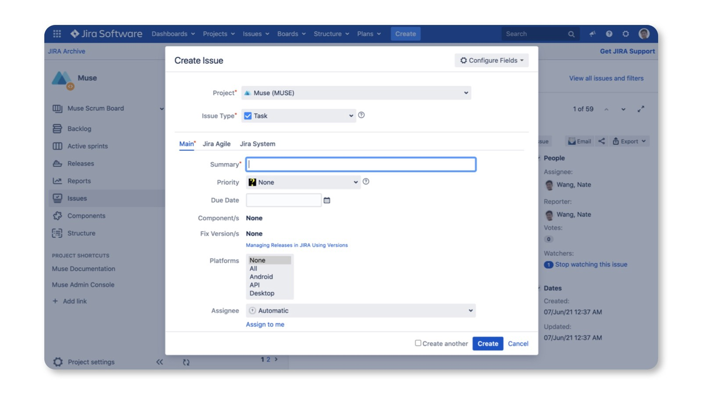

# Nice Modal

A small, zero-dependency utility for managing modals in React. It uses context to persist modal state globally so that you can easily show/hide modals either by the modal component or by id.

> You can also see the introduction at [eBay tech blog](https://medium.com/ebaytech/rethink-modals-management-in-react-cf3b6804223d).
> 
> ***Also check out another nice utility from us! [nice-form-react](https://github.com/eBay/nice-form-react)! 😜***

[](https://www.npmjs.com/package/@ebay/nice-modal-react)
[](https://www.npmjs.com/package/@ebay/nice-modal-react)
[](https://app.travis-ci.com/github/eBay/nice-modal-react)
[](https://codecov.io/github/eBay/nice-modal-react)
[](https://ebay.github.io/nice-modal-react/)
[](https://github.com/eBay/nice-modal-react/blob/main/LICENSE.md)


For example, you can use the code below to show a modal anywhere:

```jsx
import NiceModal from '@ebay/nice-modal-react';
import MyModal from './MyModal';

//...
NiceModal.show(MyModal, { someProp: 'hello' }).then(() => {
  // do something when the task in the modal finishes.
});
//...
```

Alternatively, you can register the modal with an id so that you don't need to import the modal component to use it:
```jsx
import NiceModal from '@ebay/nice-modal-react';
import MyModal from './MyModal';

NiceModal.register('my-modal', MyModal);

// you can use the string id to show/hide the modal anywhere
NiceModal.show('my-modal', { someProp: 'hello' }).then(() => {
  // do something when the task in the modal finishes.
});
//...

```

**NOTE**: `@ebay/nice-modal-react` is not a React modal component but should be used with other modal/dialog implementations by UI libraries like [Material UI](https://material-ui.com/), [Ant.Design](https://ant.design), [Bootstrap React](https://react-bootstrap.github.io/), etc.

# Examples
You can see a list of examples at: https://ebay.github.io/nice-modal-react

# Key Features
* Zero dependencies and small: ~2kb after gzip.
* Uncontrolled. You can close the modal itself within the modal component.
* Decoupled. You don't have to import a modal component to use it. Modals can be managed by id.
* Your modal component code is not executed when it's invisible.
* Doesn't break the transitions when showing/hiding a modal.
* Promise-based. Besides using props to interact with the modal from the parent component, you can do it more easily with promises.
* Easy to integrate with any UI library.

# Motivation
Using modals in React can be frustrating. Consider the scenario where you need to implement the UI below:



The dialog is used to create a JIRA ticket. It could be shown from many places: the header, the context menu, or the list page. Traditionally, we would declare modal components with a JSX tag. But then the question becomes, "Where should we declare the tag?"

The most common option is to declare it wherever it's being used. But using modals in a declarative way isn't just about a JSX tag—it's also about maintaining the modal's state, such as visibility and parameters, in the container component. Declaring it everywhere means managing the state everywhere, which is frustrating.

The other option is to put it in the Root component, for example:

```jsx
const Root = () => {
  const [visible, setVisible] = useState(false);
  // other logic ...
  return (
    <>
      <Main />
      <NewTicketModal visible={visible} />
    </>
  );
}
```

However, when you declare the modal in the root component, there are some issues:

1. Not scalable. It's unreasonable to maintain the modal's state in the root component. When you need more modals, you need to maintain a lot of state, especially when you need to maintain arguments for the modal.
2. It's hard to show or hide the modal from child components. When you maintain the state in a component, you need to pass `setVisible` down to where you need to show or hide the modal. This makes things too complicated.

Unfortunately, most examples of using modals follow this practice, which causes confusion when managing modals in React.

You've probably encountered the scenario where initially you only needed to show a modal when clicking a button, but then requirements changed and you needed to open the same modal from a different place. You then had to refactor your code to reconsider where to declare the modal. The root cause of such annoyances is simply that we haven't understood the essential nature of a modal.

# Rethink the Modal Usage Pattern in React
According to the [Wikipedia](https://en.wikipedia.org/wiki/Modal_window), a modal can be described as:

> A window that prevents the user from interacting with your application until he closes the window.

From this definition, we can conclude: a modal is a global view that's not necessarily related to a specific context.

This is very similar to the page concept in a single-page application. The visibility/state of modals should be managed globally because, from the UI perspective, a modal can be shown above any page/component. The only difference between a modal and a page is that a modal allows you to perform separate tasks without leaving the current page.

For page management, we already have router frameworks like React Router, which help navigate to a page by URL. You can think of a URL as a global id for a page. Similarly, what if you assign a unique id to a modal and then show/hide it by the id? This is exactly how we designed NiceModal.

# Usage
## Installation

```bash
# with yarn
yarn add @ebay/nice-modal-react

# or with npm
npm install @ebay/nice-modal-react
```

## Create Your Modal Component
With NiceModal, you can easily create a separate modal component. It's the same as creating a normal component but wrapped with the higher-order component `NiceModal.create`. For example, the code below shows how to create a dialog with [Ant.Design](https://ant.design):

```jsx
import { Modal } from 'antd';
import NiceModal, { useModal } from '@ebay/nice-modal-react';

export default NiceModal.create(({ name }: { name: string }) => {
  // Use a hook to manage the modal state
  const modal = useModal();
  return (
    <Modal
      title="Hello Antd"
      onOk={() => modal.hide()}
      visible={modal.visible}
      onCancel={() => modal.hide()}
      afterClose={() => modal.remove()}
    >
      Hello {name}!
    </Modal>
  );
});
```

From the code, we can see:
* The modal is uncontrolled. You can hide your modal inside the component regardless of where it's shown.
* The higher-order component created by `NiceModal.create` ensures your component isn't executed before it becomes visible.
* You can call `modal.remove` to remove your modal component from the React component tree to preserve transitions.

Next, let's see how to use the modal.

## Using Your Modal Component
There are flexible APIs for managing modals. See below for an introduction.

### Embed your application with `NiceModal.Provider`:
Since we manage the state of modals globally, the first step is to wrap your app with the NiceModal provider, for example:

```js
import NiceModal from '@ebay/nice-modal-react';
ReactDOM.render(
  <React.StrictMode>
    <NiceModal.Provider>
      <App />
    </NiceModal.Provider>
  </React.StrictMode>,
  document.getElementById('root'),
);
```

The provider will use React context to maintain all modals' state.

### Using the modal by component
You can control a nice modal by the component itself.
```js
import NiceModal from '@ebay/nice-modal-react';
import MyAntdModal from './my-antd-modal'; // created by above code

function App() {
  const showAntdModal = () => {
    // Show a modal with arguments passed to the component as props
    NiceModal.show(MyAntdModal, { name: 'Nate' })
  };
  return (
    <div className="app">
      <h1>Nice Modal Examples</h1>
      <div className="demo-buttons">
        <button onClick={showAntdModal}>Antd Modal</button>
      </div>
    </div>
  );
}
```

### Use the modal by id
You can also control a modal by id:
```js
import NiceModal from '@ebay/nice-modal-react';
import MyAntdModal from './my-antd-modal'; // created by above code

// If you use by id, you need to register the modal component.
// Normally you create a modals.js file in your project
// and register all modals there.
NiceModal.register('my-antd-modal', MyAntdModal);

function App() {
  const showAntdModal = () => {
    // Show a modal with arguments passed to the component as props
    NiceModal.show('my-antd-modal', { name: 'Nate' })
  };
  return (
    <div className="app">
      <h1>Nice Modal Examples</h1>
      <div className="demo-buttons">
        <button onClick={showAntdModal}>Antd Modal</button>
      </div>
    </div>
  );
}
```


### Use modal with the hook
The `useModal` hook can not only be used inside a modal component but also any component by passing it a modal id/component:

```jsx
import NiceModal, { useModal } from '@ebay/nice-modal-react';
import MyAntdModal from './my-antd-modal'; // created by above code

NiceModal.register('my-antd-modal', MyAntdModal);
//...
// if you use with id, you need to register it first
const modal = useModal('my-antd-modal');
// or if with component, no need to register
const modal = useModal(MyAntdModal);

//...
modal.show({ name: 'Nate' }); // show the modal
modal.hide(); // hide the modal
//...
```

### Declare your modal instead of `register`
The modal component you created can also be used as a normal component via JSX, so you don't need to register it. For example:

```jsx
import NiceModal, { useModal } from '@ebay/nice-modal-react';
import MyAntdModal from './my-antd-modal'; // created by above code

function App() {
  const showAntdModal = () => {
    // Show a modal with arguments passed to the component as props
    NiceModal.show('my-antd-modal')
  };
  return (
    <div className="app">
      <h1>Nice Modal Examples</h1>
      <div className="demo-buttons">
        <button onClick={showAntdModal}>Antd Modal</button>
      </div>
      <MyAntdModal id="my-antd-modal" name="Nate" />
    </div>
  );
}
```

With this approach, you get the following benefits:
* Inherit React context in the modal component from a parent component node.
* Pass arguments to the modal component via props.

> NOTE: If you attempt to show the component by ID but the modal is not declared or registered, nothing will happen except for a warning message in the dev console.

### Using promise API

Besides using props to interact with the modal from the parent component, you can do it more easily with promises. For example, we have a user list page with an "add user" button that shows a dialog. After the user is added, the list should refresh itself to reflect the change. We can use the code below:

```jsx
NiceModal.show(AddUserModal)
  .then(() => {
    // When call modal.resolve(payload) in the modal component
    // it will resolve the promise returned by `show` method.
    // fetchUsers will call the rest API and update the list
    fetchUsers()
  })
  .catch(err=> {
    // if modal.reject(new Error('something went wrong')), it will reject the promise
  }); 
```

You can see the live example on codesandbox.

### Integrating with Redux
Though not necessary, you can integrate Redux to manage the state of modals. This allows you to use Redux dev tools to track/debug state changes of modals. Here's how to do it:

```jsx
// First combine the reducer
import { createStore, applyMiddleware, compose, combineReducers } from 'redux';
import { Provider, useSelector, useDispatch } from 'react-redux';
import NiceModal from '@ebay/nice-modal-react';
import { Button } from 'antd';
import { MyAntdModal } from './MyAntdModal';
import logger from 'redux-logger';

const composeEnhancers = (typeof window !== 'undefined' && window.__REDUX_DEVTOOLS_EXTENSION_COMPOSE__) || compose;
const enhancer = composeEnhancers(applyMiddleware(logger));

const store = createStore(
  combineReducers({
    modals: NiceModal.reducer,
    // other reducers...
  }),
  enhancer,
);

// Passing Redux state to the nice modal provider
const ModalsProvider = ({ children }) => {
  const modals = useSelector((s) => s.modals);
  const dispatch = useDispatch();
  return (
    <NiceModal.Provider modals={modals} dispatch={dispatch}>
      {children}
    </NiceModal.Provider>
  );
};

export default function ReduxProvider({ children }) {
  return (
    <Provider store={store}>
      <ModalsProvider>{children}</ModalsProvider>
    </Provider>
  );
}
```

### Using with any UI library
NiceModal provides lifecycle methods to manage modal state. You can use the modal handler returned by the `useModal` hook to bind any modal-like component to the state. Below are typical states and methods you'll use:

* ***modal.visible**: the visibility of a modal.
* ***modal.hide**: hides the modal by changing `modal.visible` to false.
* ***modal.remove**: removes the modal component from the tree so that your modal's code isn't executed when it's invisible. Usually, you call this method after the modal's transition.
* ***modal.keepMounted**: if you don't want to remove the modal from the tree in some instances, you can decide whether to call `modal.remove` based on the value of `keepMounted`.

Based on these properties/methods, you can easily use NiceModal with any modal-like component provided by any UI libraries.

### Using help methods
As you already saw, we use code similar with below to manage the modal state:

```jsx
//...
const modal = useModal();
return (
  <Modal
    visible={modal.visible}
    title="Hello Antd"
    onOk={() => modal.hide()}
    onCancel={() => modal.hide()}
    afterClose={() => modal.remove()}
  >
    Hello NiceModal!
  </Modal>
);
//...
```

It binds `visible` property to the `modal` handler, and uses `modal.hide` to hide the modal when close button is clicked. And after the close transition it calls `modal.remove` to remove the modal from the dom node.

For every modal implementation, we always need to do these bindings manually. So, to make it easier to use we provided helper methods for 3 popular UI libraries Material UI, Ant.Design and Bootstrap React.


```jsx
import NiceModal, {
  muiDialog,
  muiDialogV5,
  antdModal,
  antdModalV5,
  antdDrawer,
  antdDrawerV5,
  bootstrapDialog
} from '@ebay/nice-modal-react';

//...
const modal = useModal();
// For MUI
<Dialog {...muiDialog(modal)}>

// For MUI V5
<Dialog {...muiDialogV5(modal)}>

// For ant.design
<Modal {...antdModal(modal)}>

// For ant.design v4.23.0 or later
<Modal {...antdModalV5(modal)}>

// For antd drawer
<Drawer {...antdDrawer(modal)}>

// For antd drawer v4.23.0 or later
<Drawer {...antdDrawerV5(modal)}>

// For bootstrap dialog
<Dialog {...bootstrapDialog(modal)}>

```

These helpers will bind modal's common actions to correct properties of the component. However, you can always override the property after the helper's property. For example:

```jsx
const handleSubmit = () => {
  doSubmit().then(() => {
    modal.hide();
  });
}
<Modal {...antdModal(modal)} onOk={handleSubmit}>
```

In the example, the `onOk` property will override the result from `antdModal` helper.

## API Reference
https://ebay.github.io/nice-modal-react/api/

## Testing

You can test your nice modals with tools like `@testing-library/react`.

```jsx
import NiceModal from '@ebay/nice-modal-react';
import { render, act, screen } from '@testing-library/react';
import { MyNiceModal } from '../MyNiceModal';

test('My nice modal works!', () => {
  render(<NiceModal.Provider />);
  
  act(() => {
    NiceModal.show(MyNiceModal);
  });
  
  expect(screen.getByRole('dialog')).toBeVisible();
});
```

## Contribution Guide
```bash
# 1. Clone repo
git clone https://github.com/eBay/nice-modal-react.git

# 2. Install deps
cd nice-modal-react
yarn

# 3. Make local repo as linked
yarn link

# 4. Start dev server
yarn dev

# 5. Install examples deps
cd example
yarn

# 6. Use local linked lib
yarn link @ebay/nice-modal-react

# 7. Start examples dev server
yarn start
```

Then you can access http://localhost:3000 to see the examples.

## FAQ
### Can I get context in the component tree in a modal?
Yes. To get the data from context in the component tree you need to use the declarative way. For example:
```jsx
export default function AntdSample() {
  return (
    <>
      <Button type="primary" onClick={() => NiceModal.show('my-antd-modal', { name: 'Nate' })}>
        Show Modal
      </Button>
      <MyAntdModal id="my-antd-modal" {...otherProps} />
    </>
  );
}
```
See more [here](https://github.com/eBay/nice-modal-react/issues/104).

# License
MIT


